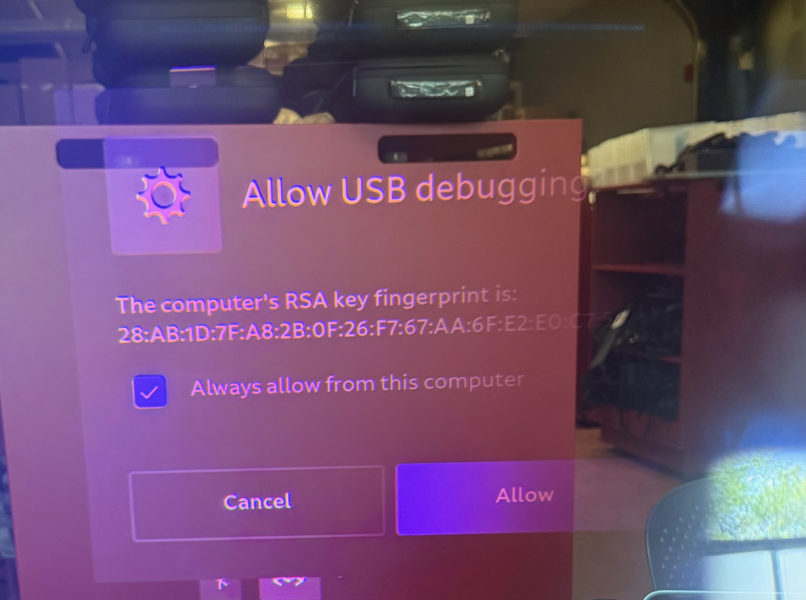
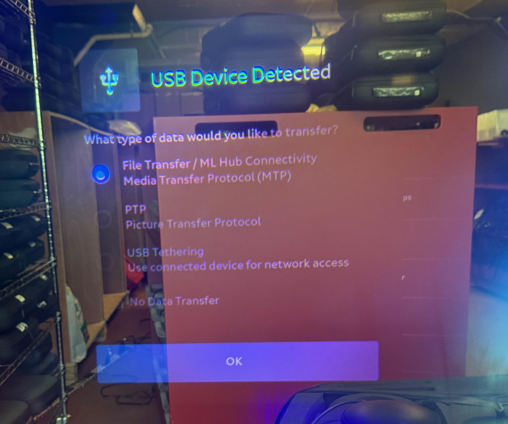

# KAGAMI Device Provisioning Guide
### Tin Drum / Magic Leap 2 Fleet Management

This guide covers the complete process for flashing and provisioning a single Magic Leap 2 device. Each device takes approximately 15–20 minutes total.

---

## Before you start

- Toolkit must be installed (see **SETUP.md**)
- **Select the show this machine is provisioning** (one-time per machine):
  ```
  ./ml_show.sh            # see the active show
  ./ml_show.sh use KAGAMI # set it (or another show id)
  ```
  Setting up a brand-new show on site: `./ml_show.sh init` (prompts for WiFi, package, etc.). Every flash/provision/deploy is bound to the active show.
- The show's WiFi network must be broadcasting nearby (SSID/password come from the show config — `KAGAMI` / `KAGAmius` for the KAGAMI show)
- You need the device number and case number from the tracking sheet
- Have the controller for the device ready

---

## Overview

| Phase | Who | Time | Notes |
|---|---|---|---|
| Flash OS | Script (unattended) | ~10 min | Just watch for errors |
| Provisioning | Script (unattended) | ~2 min | Enter device/case/initials first |
| Controller update | Manual | ~2 min | Connect USB-C to compute pack |
| Headset settings | Manual | ~2 min | 4 settings to change |

---

## Step 1 — Put device into fastboot mode

The device must be powered OFF before entering fastboot.

1. If the device is on: **hold the Power button** until it shuts down completely
2. **Hold Volume Down + press Power** to start in fastboot mode
3. You'll see a fastboot indicator LED on the Compute Pack

---

## Step 2 — Connect to your laptop

Plug the USB-C cable from the Compute Pack into your laptop.

---

## Step 3 — Open Terminal and navigate to the toolkit

```
cd ~/Developer/ml_toolkit
```

---

## Step 4 — Run the flash script

```
./ml_os_flash.sh
```

Or if you skipped Step 3:

```
cd ~/Developer/ml_toolkit && ./ml_os_flash.sh
```

The script will automatically find the OS image in `os_images/` and use it. If there is more than one OS version in that folder, it will ask you to choose — but in normal operation there will only be one. You can also pass the version name directly to skip the menu, e.g. `./ml_os_flash.sh [directory name in os_images]`.

The script will detect the device and show you a confirmation screen like this:

```
ML2 OS Flash Helper

  Device:     G572XT1000XX
  State:      already in fastboot — skipping reboot

  Device:  G572XT1000XX
  From:    unknown
  To:      1.4.1

  Show: KAGAMI (KAGAMI)
  SSID KAGAMI · pkg com.tindrum.kagamu · devices devices/KAGAMI.txt (7)

  About to flash 1.4.1 + factory reset for the KAGAMI fleet.
  Press Enter to continue, or S for other available show configurations: _
```

> **Confirm the show.** This is the safety gate that binds the flash (and the provision/deploy that follow) to the correct show — wrong show means wrong WiFi and wrong build. Press **Enter** to proceed with the show shown. If the wrong show is shown, press **S** to pick a different configured show, or Ctrl+C to abort and run `./ml_show.sh use <id>`.

---

## Step 5 — Confirm and enter device info

Press **Enter** to confirm the show shown, then enter the device tracking information:

```
Device tracking
  Device number (or Enter to skip): [enter device number]
  Case number   (press Enter if it matches the device number, or is unknown): [enter case number]
  Operator initials: [your initials, e.g. JD]
```

After entering these, the script runs completely unattended for ~10 minutes. You will see partition flashing progress on screen.

> **Case number:** Enter the physical case number if it differs from the device number. Press Enter to leave it blank — the sheet will treat a blank case number as matching the device number, or unknown.
>
> **Operator initials:** These are written to the "Operator name - Phase 1" column in the tracking sheet. Enter 2–4 characters, e.g. `JD` or `MLC`.

---

## Step 6 — Wait for flash and provisioning to complete

The script will:
1. Flash all OS partitions (~10 min)
2. Reboot the device
3. Inject ADB authorization keys
4. Skip the setup wizard automatically
5. Apply all settings (brightness, WiFi, battery, display, etc.)
6. Connect to KAGAMI WiFi
7. Update the tracking sheet automatically

When complete you will see:

```
Provisioning complete.

Manual steps — put on headset and complete:
  [ ] Connect controller to device via USB-C → allow firmware update
  [ ] Connect device to laptop — two dialogs will appear:
        • "Allow USB debugging" → check "Always allow from this computer" → Allow
        • "USB Device Detected" → OK
  [ ] Battery → Compute Pack Standby → Off
  [ ] Display → Display Override → Off
  [ ] Display → Global Dimming → just below max, even with h in 'light'
  [ ] Display → Segmented Dimming → On
  [ ] Display → Maximum Dimming → just below max, even with l in 'display'
  [ ] System → Advanced → OS Updater → Check for updates → Never

  Device #:      [number]
  Operator:      [initials]
  Device Serial: [serial]
  Device IP:     [ip]
```

The serial number is automatically copied to your clipboard.

---

## Step 7 — Controller firmware update

1. Connect the **controller** to the **Compute Pack** via USB-C
2. Put on the headset — you will see a firmware update progress screen
3. Wait for the update to complete (~2 minutes)
4. Disconnect the controller USB-C cable when done

---

## Step 8 — Complete manual settings in headset

Using the controller, navigate to each setting:

**Allow USB Debugging (if prompted):**

Two dialogs appear when the device is connected to the laptop.



1. **"Allow USB debugging"** — check **Always allow from this computer**, then tap **Allow**

   This blesses the fleet ADB key so this dialog won't appear again for this laptop, or any other laptop using the fleet ADB key.



2. **"USB Device Detected"** — tap **OK**

   This dialog appears on every connection regardless of authorization — just dismiss it.

**Battery:**
- Settings → Battery → **Compute Pack Standby → Off**

**Display:**
- Settings → Display → **Display Override → Off**
- Settings → Display → **Global Dimming** → just below maximum, even with the *h* in "light"
- Settings → Display → **Segmented Dimming → On**
- Settings → Display → **Maximum Dimming** → just below maximum, even with the *l* in "display"

**System:**
- Settings → System → Advanced → OS Updater → **Check for updates → Never**

---

## Step 9 — Add device IP to fleet list

> **Note:** The IP shown at the end of provisioning is on the provisioning WiFi network. It will be different on site once the show APs are configured with static IPs. You'll rebuild the active show's `devices/<show>.txt` on site via `./utilities/ml_scan.sh` before running `ml_deploy.sh` or `ml_status.sh`.

For reference, the command to add an IP by hand is:

```
echo '[device ip]' >> devices/$(cat .active_show).txt
```

Or just rescan: `./utilities/ml_scan.sh --append`.

---

## Step 10 — Verify and move to next device

Run a quick check to confirm all settings are correct:

```
./ml_provision.sh --check
```

All items should show ✓. The ⊙ items are the manual ones you just completed in the headset.

Disconnect the device and repeat from Step 1 for the next device.

---

## Troubleshooting

**Script says "No device found over USB"**
- Make sure the device is in fastboot mode (Volume Down + Power)
- Try a different USB-C cable or port
- Check the fastboot LED is showing on the Compute Pack

**Flash fails partway through**
- The `ecfw` partition often fails — this is normal and harmless
- The script will auto-reboot and continue
- If something else fails, run `fastboot reboot` and try again

**WiFi didn't connect**
- Make sure the KAGAMI network is broadcasting
- Run `./ml_provision.sh` again after the network is available
- Or connect manually: Settings → Network & Internet → WiFi → KAGAMI

**Tracking sheet not updating**
- Check your internet connection
- The sheet update runs silently — check the sheet directly
- If missing, the provisioned_devices.csv file on your laptop has all the data

**"No arrows" in headset UI after provisioning**
- This indicates a corrupted provisioning state
- Reflash the device: run `./ml_os_flash.sh 1.4.1` again

---

## Quick reference — Terminal commands

```bash
# Flash and provision a device (auto-selects the OS in os_images/)
./ml_os_flash.sh

# Flash a specific version (if multiple OS versions are in os_images/)
./ml_os_flash.sh 1.4.1

# Provision only (no flash) — single USB-connected device
./ml_provision.sh

# Provision a specific device by IP
./ml_provision.sh -d [ip]

# Check device settings — single device
./ml_provision.sh --check

# Apply ADB-settable settings to every device in the active show's fleet list (drift remediation)
./ml_provision.sh --fleet

# Check settings across entire fleet
./ml_provision.sh --fleet --check

# Scan network and write devices/<show>.txt
./utilities/ml_scan.sh

# Deploy to a single device — connects, prompts for APK selection, pushes assets, installs
./ml_deploy.sh -d [ip] deploy

# Deploy to every device in the active show's fleet list
./ml_deploy.sh deploy

# Connect to all devices over WiFi (done automatically by deploy)
./ml_deploy.sh connect

# Check status of all devices in fleet
./ml_status.sh

# Only show devices with problems
./ml_status.sh --failures

# Collect status and auto-fix bad settings
./ml_status.sh --fix

# Export JSON for the visual dashboard (fleet_dashboard.html)
./ml_status.sh --json > status/latest.json
```

### ml_deploy.sh commands

| Command | Description |
|---|---|
| `deploy` | Interactive: select APK(s), install, set kiosk as home app — connects automatically |
| `connect` | Connect to every device in the active show's `devices/<show>.txt` over WiFi ADB |
| `status` | Show online/offline status of all devices |
| `install <path.apk>` | Install a specific APK to all online devices |
| `push <src> <dest>` | Push a file or folder to all online devices |
| `launch <package>` | Launch an app by package name on all online devices |
| `stop <package>` | Force-stop an app on all online devices |
| `restart <package>` | Stop then relaunch an app on all online devices |
| `reboot` | Reboot all online devices |
| `shutdown` | Power off all online devices (nightly end-of-day) |
| `shell <cmd>` | Run any `adb shell` command on all online devices |
| `logs <package>` | Stream logcat for a package from all online devices |

### ml_deploy.sh options

| Option | Description |
|---|---|
| `-d <ip>` | Target a single device by IP instead of the active show's fleet list |
| `-f <file>` | Use an alternate devices file (default: the active show's `devices/<show>.txt`, falling back to legacy `devices.txt`) |
| `-j <n>` | Max parallel jobs (default: 20) |

### ml_status.sh flags

Run with no flags for a colored pass/fail table to the terminal. All output modes collect from every online device in parallel and also write per-device raw JSON to `status/<timestamp>/`.

| Flag | Description |
|---|---|
| _(none)_ | Collapsed pass/fail table to terminal — OS, Kagami/Kiosk version, battery, settings, overall OK |
| `--json` | Emit a single JSON array of all devices to stdout — pipe to a file to feed `fleet_dashboard.html` |
| `--csv` | Emit CSV (one row per device) for spreadsheet import |
| `--failures` | Table mode, but only print devices that have at least one failing check |
| `--fix` | After collecting, auto-fix the drift `--fix` actually handles: stay-awake → on (`stay_on_while_plugged_in=3`), Bluetooth → on (`svc bluetooth enable`), brightness → `$SHOW_BRIGHTNESS` from the active show's conf (also force-disables auto-brightness first so the value sticks). Display/dimming and Compute-Pack-Standby are headset-manual and aren't `--fix`-able. |
| `--package <pkg>` | Override which app package to report/check (default: active show's `SHOW_PACKAGE`) |
| `--expected-os <ver>` | Flag any device whose OS version ≠ `<ver>` as failing (default: active show's `SHOW_EXPECTED_OS`) |
| `--expected-apk <ver>` | Flag any device whose APK version ≠ `<ver>` as failing (default: active show's `SHOW_EXPECTED_APK`) |
| `-f <file>` | Use an alternate devices file (default: the active show's `devices/<show>.txt`, falling back to legacy `devices.txt`) |

### ml_status.sh environment variables

Each is the env-var equivalent of a flag; the flag wins if both are set.

| Variable | Equivalent to | Default |
|---|---|---|
| `ML_PACKAGE` | `--package` | active show's `SHOW_PACKAGE` |
| `ML_EXPECTED_OS` | `--expected-os` | active show's `SHOW_EXPECTED_OS` — blank skips the check |
| `ML_EXPECTED_APK` | `--expected-apk` | active show's `SHOW_EXPECTED_APK` — blank skips the check |
| `ML_BRIGHTNESS` | (no flag) | active show's `SHOW_BRIGHTNESS` — used by `--fix` |
| `ML_KIOSK_VERSION` | (no flag) | active show's `SHOW_KIOSK_VERSION` — blank skips the check |

**Feeding the dashboard:** `fleet_dashboard.html` does not read files automatically — generate the JSON, then load it in the page:

```bash
./ml_status.sh --json > status/latest.json
# then open fleet_dashboard.html and click "Load JSON" (or drag the file onto the page)
```
